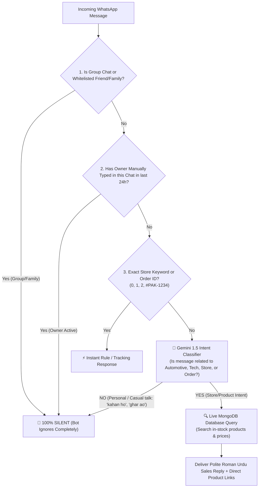

# 🤖 Pak-o-Drive — Dual-Mode (Personal + Store) Gemini AI WhatsApp Bot

## 🎯 Target Goal
Aapka WhatsApp number **Personal / Family / Friends** ke liye bhi use hota hai aur **Store Customers** ke liye bhi.  
Is architecture ka maqsad yeh hai ke:
1. **Friends & Family ke normal messages par Bot bilkul khamosh (Silent / 0 Reply) rahe.**
2. **Sirf aur sirf jab koi message Pak-o-Drive ke products, car accessories, orders, pricing ya website se related ho — tab Gemini AI active ho.**
3. **Gemini aapke live MongoDB Database ko access kar ke real-time products, prices aur stock verify kare.**

---

## 🏛️ Smart Dual-Mode Decision Architecture



---

## 🛡️ 4 Layer Personal Protection System (Friends & Family Safety)

### 1. 🎯 Gemini Two-Step Smart Intent Classifier (Zero False Triggers)
Har incoming message par Gemini pehle ek ultra-fast classification run karega:
```json
{
  "is_store_related": true | false,
  "confidence": 0.95,
  "detected_category": "car_accessories" | "order_inquiry" | "personal_chat"
}
```
- **Agar message yeh ho:** *"Kahan ho bhai?", "Ghar kab ao ge?", "Khana kha lia?", "Pic send karo"*  
  ➔ `is_store_related: false` ➔ **Bot bilkul chup rahega (No reply at all).**
- **Agar message yeh ho:** *"Bhai Civic ke liye speakers hain?", "Delivery kab tak hogi?", "Led lights ki price kya hai?"*  
  ➔ `is_store_related: true` ➔ **Bot foran database search kar ke reply karega.**

---

### 2. 🗄️ Live MongoDB Database Tool (Real-Time Catalog Access)
Gemini ko aapke MongoDB database ka direct access milega via internal search function:
- **Query:** Customer asks *"Android panel for Alto"*
- **MongoDB Action:** System runs:
  ```ts
  Product.find({
    $text: { $search: "Android panel Alto" },
    stock: { $gt: 0 }
  }).select('name price originalPrice image slug stock category');
  ```
- **Gemini Response:**
  > *"Jee bhai! Suzuki Alto ke liye 9-inch IPS Android Multimedia Panel available hai sirf Rs. 14,500 mein (Free COD Delivery across Pakistan).*  
  > 📦 **Product Link:** https://pakodrive.com/product/alto-android-panel  
  > *Is mein 2GB/32GB + Apple CarPlay support shamil hai. Kya aapko order book karna hai?"*

---

### 3. 👥 Family & Friends Whitelist Numbers (100% Excluded)
Admin panel (`/admin/whatsapp-bot`) mein ek **"Excluded Personal Numbers"** box hoga:
- Aap apne ghar ke, doston ke ya personal contacts ke numbers wahan daal sakte hain (e.g. `03001234567, 03129876543`).
- In numbers se aane wale kisi bhi message par bot **kabhi bhi reply nahi karega**.

---

### 4. 🤫 Owner Manual Reply Auto-Mute (Smart Takeover)
- Jab aap (Owner) apne phone se kisi bhi chat mein manually koi message send karenge, bot us chat ko recognize kar ke **next 24 se 48 ghante ke liye mute** kar dega.
- Is se kabhi bhi do do log ek sath reply nahi karenge.

---

## 🛠️ Step-by-Step Implementation Strategy

| Step | Component | Description |
| :--- | :--- | :--- |
| **1. Intent Classifier** | `src/lib/geminiClassifier.ts` | Gemini prompt jo personal chat aur e-commerce intent ko 100% accurately differentiate kare. |
| **2. Live MongoDB Tool** | `src/lib/geminiCatalog.ts` | Database search handler jo live products, stock aur PKR prices Gemini ko feed kare. |
| **3. Bot Worker Integration** | `src/worker/bot.mjs` | Mute logic, group-ignore, family whitelist aur intent branching. |
| **4. Admin Settings Panel** | `/admin/whatsapp-bot` | Whitelist phone numbers manager aur Gemini AI toggle. |

---

## 💡 Result
Aap apna ek hi WhatsApp number ghar ke liye aur business ke liye aaram se use kar sakenge — doston ko aam insan ki tarah khud reply karenge, aur customers ko Gemini 24/7 handle karega!
