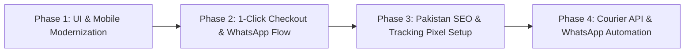

# 🇵🇰 Pak-o-Drive: E-Commerce Business, UI/UX, SEO & Growth Blueprint
**Comprehensive Strategy & Audit Report for Online Selling in Pakistan**
*Date: 2026-08-25 | Brand: PAKODRIVE*

---

## 📑 Table of Contents
1. [Project Overview & Architecture Audit](#1-project-overview--architecture-audit)
2. [UI/UX & Visual Theme Modernization](#2-uiux--visual-theme-modernization)
3. [Customer Grabbing & Conversion Rate Optimization (CRO)](#3-customer-grabbing--conversion-rate-optimization-cro)
4. [Search Engine Optimization (SEO) & Google Ranking Strategy](#4-search-engine-optimization-seo--google-ranking-strategy)
5. [Pakistan Market Nuances & Logistics Blueprint](#5-pakistan-market-nuances--logistics-blueprint)
6. [Site Reach & Traffic Funnel (Paid Ads & Marketing)](#6-site-reach--traffic-funnel-paid-ads--marketing)
7. [Step-by-Step Implementation Roadmap](#7-step-by-step-implementation-roadmap)

---

## 1. Project Overview & Architecture Audit

### 1.1 Current Tech Stack
- **Framework:** Next.js 16 (App Router) + React 19
- **Styling:** TailwindCSS v4, Bootstrap CSS mix, Custom Responsive Variables
- **Database & Storage:** MongoDB (Mongoose), Cloudinary for optimized media
- **Features Already Built:**
  - Dynamic Theme & Settings Provider
  - Admin Panel (Products, Categories, Orders, Site Info, Analytics, Promotions)
  - Cart & Checkout System
  - WhatsApp Floating Contact
  - UTM Parameter Tracker & Vercel Analytics

### 1.2 Identified Technical Strengths & Opportunities
| Area | Current Status | Recommended Upgrade |
| :--- | :--- | :--- |
| **Mobile Speed** | Good base with Next.js SSR | Preload hero media, remove redundant legacy CSS, enable aggressive static generation. |
| **Checkout Flow** | Standard multi-step input | Simplify to a 1-page, 4-field frictionless Cash on Delivery (COD) form. |
| **Tracking** | Basic UTM + Analytics | Full Integration with Meta Pixel + CAPI, TikTok Pixel, Google Analytics 4. |

---

## 2. UI/UX & Visual Theme Modernization

Pakistan ke e-commerce user ko attract karne ke liye visual hierarchy bohot crisp aur trustworthy honi chahiye.

### 2.1 Modern Color Palette & Typography
- **Primary Color:** Midnight Slate (`#0F172A`) — Premium, modern tech feel.
- **Accent/Action Color:** Electric Amber / Coral Blaze (`#FF6B00` ya `#F59E0B`) — High contrast for "Order Now", "Add to Cart", "Flash Sale".
- **Trust Color:** Verified Emerald Green (`#10B981`) — For "Free Shipping", "Cash on Delivery", "In Stock".
- **Typography:** `Inter` (sans-serif) for clean UI + bold numerals for PKR prices.

### 2.2 Mobile-First Experience (85%+ Traffic in Pakistan)
1. **Sticky Bottom Action Bar (Mobile Screens):**
   - Jab customer product page scroll kare, screen ke bottom par sticky bar fix ho:
     `[ 💬 Order on WhatsApp ]` + `[ ⚡ Cash on Delivery (Buy Now) ]`
2. **High-Impact Product Cards:**
   - Dual-image flip on hover / swipe.
   - Distinctive Discount Badge (e.g., `-35% OFF` in vibrant red/orange).
   - Clear price contrast: **Rs. 2,499** in bold large font, strike-through original price ~~Rs. 3,850~~.
   - Star Rating Badge (`⭐ 4.9 (86 reviews)`).
3. **Clean Micro-Interactions:**
   - Shimmer / Skeleton loader on product grids.
   - Animated floating cart counter with instant slide-out drawer instead of page redirects.

---

## 3. Customer Grabbing & Conversion Rate Optimization (CRO)

Pakistan me customer buying decision 3 cheezon par depend karti hai: **Trust (اعتماد), Speed (تیزی), aur Urgency (جلدی).**

```
┌─────────────────────────────────────────────────────────────┐
│                 PAKISTANI BUYER TRUST PYRAMID                │
├─────────────────────────────────────────────────────────────┤
│  Top: Social Proof & Real Unboxing Videos (TikTok/Reels)   │
│  Mid: 7-Days Return / Replacement Guarantee + Open Parcel   │
│  Base: Nationwide Cash on Delivery (COD) & WhatsApp Support │
└─────────────────────────────────────────────────────────────┘
```

### 3.1 Trust Triggers on Product Page
- 🛡️ **Cash on Delivery (COD) Badge:** "پورے پاکستان میں کیش آن ڈلیوری دستیاب ہے"
- 📦 **7-Day Easy Replacement Policy:** Hassle-free exchange guarantee.
- 🚚 **Dynamic City Delivery Estimates:**
  - *Karachi, Lahore, Islamabad, Rawalpindi:* 24 to 48 Hours.
  - *Other Cities (Faisalabad, Multan, Peshawar, etc.):* 2 to 4 Days.
- 📹 **Short Video Reviews / Reels Player:** Embed customer feedback videos showing real unboxed items.

### 3.2 1-Click Frictionless Checkout Form
Pakistani users drop off if asked to register or enter unnecessary information.
**Required Fields Only:**
1. **Full Name** (نام)
2. **WhatsApp / Mobile Number** (03XX-XXXXXXX)
3. **Complete Delivery Address** (گھر / دکان کا مکمل پتہ)
4. **City Selection Dropdown** (Karachi, Lahore, Islamabad, Multan, Peshawar, etc. to prevent courier delivery errors)

### 3.3 Urgency & Social Proof Widgets
- ⏳ **Flash Sale Countdown Timer:** *"Deal ends tonight at 12:00 AM"*
- ⚠️ **Stock Scarcity Meter:** *"Only 3 left in stock - 18 people viewing this"*
- 🔔 **Recent Purchase Toast Notification:** *"Hamza from Lahore just ordered Fast Wireless Charger 4 mins ago"*

---

## 4. Search Engine Optimization (SEO) & Google Ranking Strategy

### 4.1 Local Pakistan High-Intent Keywords
Target search queries with high purchase intent in Google Pakistan:

| Category | Primary Keywords | Secondary / Long-tail Keywords |
| :--- | :--- | :--- |
| **Electronics** | Best wireless earbuds price in Pakistan | Original fast charger for iPhone in Karachi, Type-C 65W PD charger price |
| **Smart Gadgets** | Smart watch price in Pakistan | Waterproof calling smartwatch COD Lahore, Bluetooth smartwatch under 5000 |
| **Car Accessories** | Car electronics & gadgets Pakistan | Bluetooth car transmitter Islamabad, Portable car tire inflator COD |

### 4.2 Technical SEO Checklist
- [x] **Product Structured Data (`JSON-LD`):**
  - Name, Image, Price in `PKR`, PriceValidUntil, InStock status, AggregateRating.
- [x] **Breadcrumb Schema & Canonical Tags:** Ensures clean site structure for Google crawlers.
- [x] **Dynamic Sitemap (`sitemap.xml`):** Auto-updates when new products/categories are added in admin.
- [x] **Google Merchant Center Feed:** Automated XML feed for Google Shopping / Performance Max listing.
- [x] **Urdu & Roman Urdu FAQs:** Include answers to questions like *"Delivery kitne din me hogi?"*, *"Parcel open karke check kar sakte hain?"*.

---

## 5. Pakistan Market Nuances & Logistics Blueprint

### 5.1 Courier & COD Operations
Pakistan me e-commerce me 80%+ orders **Cash on Delivery** par aate hain.

| Courier Partner | Strengths | API Integration |
| :--- | :--- | :--- |
| **PostEx** | Fast Cash Recovery (Instant Remittance), great portal | Automated Booking API |
| **Trax** | Strong nationwide coverage, good COD reconciliation | Automated Booking API |
| **Leopards Courier** | Reliable tier-2 / tier-3 city network | Full API support |
| **TCS** | Premium urban deliveries & brand trust | Corporate API |

### 5.2 Fake Order & RTO (Return to Origin) Prevention
RTO rate ko 25% se kam karke **<7%** par laane ke liye:
1. **Automated WhatsApp Order Confirmation:**
   - Order aate hi customer ke WhatsApp par confirmation button bhejain:
     `[ ✅ Confirm Order ]` | `[ ❌ Cancel Order ]`
2. **Repeated/Spam Order Filtering:**
   - Ek hi IP/Phone number se fake clicks ko block karna.
3. **Address Verification Checklist:**
   - Complete house/street number check.

---

## 6. Site Reach & Traffic Funnel (Paid Ads & Marketing)

### 6.1 The 4-Pillar Customer Acquisition Model

```
       [ 1. Paid Traffic ]
       • Meta Ads (Instagram / Facebook Reels & Carousels)
       • TikTok Ads (Short Product Demos & Unboxings)
       • Google Shopping / Search Ads
                  │
                  ▼
       [ 2. High Converting Store Landing Page ]
       • Fast Load (< 1.5s)
       • Clear PKR Pricing & Discount Badges
       • WhatsApp Direct Order + 1-Click COD Checkout
                  │
                  ▼
       [ 3. Order Verification & Retention ]
       • Instant WhatsApp Confirmation
       • SMS Dispatch Tracking Link
                  │
                  ▼
       [ 4. Automated Re-marketing ]
       • WhatsApp Abandoned Cart Follow-up (10% OFF coupon)
       • Repeat customer VIP broadcast
```

### 6.2 Key Tracking Integrations
- **Meta Pixel + Conversions API (CAPI):** Tracks `PageView`, `ViewContent`, `AddToCart`, `InitiateCheckout`, and `Purchase` with 100% data fidelity.
- **TikTok Pixel:** Critical for viral gadget sales in Pakistan.
- **Google Tag Manager (GTM):** Centralized event management.

---

## 7. Step-by-Step Implementation Roadmap



### Phase 1: UI & Visual Modernization (Completed ✅)
- [x] Upgrade product cards with hover preview, stock tags, and bold PKR pricing.
- [x] Implement Mobile Sticky Bottom Bar (Order on WhatsApp + Buy Now).
- [x] Add trust banner on Header & Product page (Nationwide COD, 7-Day Returns, Verified Quality).

### Phase 2: Checkout & Conversion Engine (Completed ✅)
- [x] Create streamlined 1-page checkout with Pakistan major cities dropdown.
- [x] Add "Direct Order via WhatsApp" pre-filled message generator.
- [x] Integrate real-time sales toast notifications and scarcity indicators.

### Phase 3: SEO, Schemas & Tracking (Completed ✅)
- [x] Verify complete `JSON-LD` Product and Offer schema with `currency: "PKR"`.
- [x] Setup Meta Pixel and TikTok Pixel event triggers on AddToCart & Checkout.
- [x] Generate Google Merchant Center XML feed.

### Phase 4: Logistics & Retention (Completed ✅)
- [x] Integrate Courier API for single-click dispatch booking from Admin Panel.
- [x] Implement WhatsApp Abandoned Cart recovery and order confirmation messages.

---

*Report prepared for **PAKODRIVE** — Pakistan's Next-Gen Online Electronics Store.*
