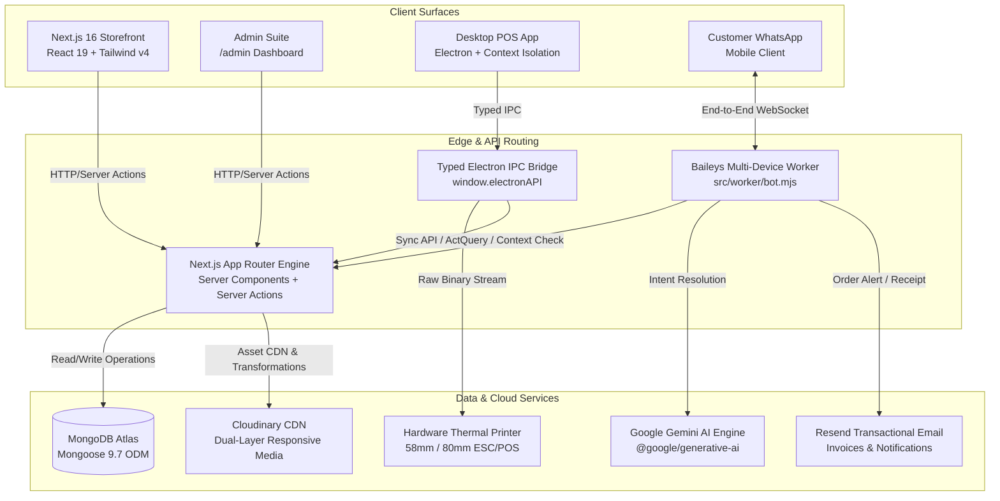

# 🏗️ Technical Architecture & System Design — Pak-o-Drive

## 1. Architectural Topology Overview
Pak-o-Drive is implemented as a unified full-stack monorepo delivering high performance across four operational planes: Web Storefront, Admin Suite, Desktop POS, and AI WhatsApp Worker.



---

## 2. Technology Stack & Runtime Matrix

| Layer | Technology | Version | Purpose & Rationale |
| :--- | :--- | :--- | :--- |
| **Framework Core** | Next.js App Router | `16.3.0-preview.5` | React Server Components (RSC), zero-bundle server logic, streaming SSR. |
| **UI Library** | React & React-DOM | `19.2.4` | Latest concurrent features, compiler integration, useTransition, useOptimistic. |
| **Compiler / Build** | Babel React Compiler + TSX | `1.0.0` / `4.23.13` | Fine-grained automatic memoization and TypeScript compilation. |
| **Type Safety** | TypeScript | `^5.0.0` | Strict typing across API contracts, Mongoose models, and client state. |
| **Styling Engine** | Tailwind CSS (PostCSS) | `^4.0.0` | Ultra-fast CSS compilation, CSS variables, native RTL and mobile utilities. |
| **Database & ODM** | MongoDB + Mongoose | `^9.7.1` | Document database for catalog versatility, polymorphic variants, and audit history. |
| **Media Delivery** | Cloudinary SDK | `^2.10.0` | Automated WebP/AVIF transcoding, responsive width generation, ambient blur caching. |
| **Desktop Runtime** | Electron.js | Embedded | Cross-platform hardware driver integration for retail counter POS terminals. |
| **Messaging Engine** | `@whiskeysockets/baileys` | `7.0.0-rc14` | Direct WhatsApp multi-device socket protocol without expensive vendor per-message fees. |
| **AI Intelligence** | Google Generative AI | `^0.24.1` | Gemini model for conversational catalog search and customer query resolution. |
| **Transactional Email**| Resend | `^6.14.0` | Fast, deliverable order receipts, password resets, and dispatch notices. |
| **Observability** | PostHog + Vercel Analytics | `^1.391.2` / `^2.0.1`| Conversion funnel tracking, Core Web Vitals, and client-side error telemetry. |

---

## 3. State Management & Data Ingestion Pipeline

### Presentation vs. Domain Logic Separation
Under the **Zero-Logic UI Policy**:
- **View Layer (`src/app/`, `src/components/`)**: Pure presentational TSX. Components receive serialized props and hook handlers. No direct `fetch()`, `mongoose` queries, or local calculation logic.
- **Hook Layer (`src/hooks/`)**: Encapsulates component-level business logic (e.g., `useCart`, `useCheckout`, `useOtpVerification`, `useOrderTracker`).
- **Context Layer (`src/context/`)**: Manages global client state (`CartContext`, `WishlistContext`, `ThemeContext`).

### Data Ingestion Flow (Server Actions & Mutation Pipeline)
1. **Client Action Dispatch**: A client component invokes a Server Action exported from `src/actions/` via standard React 19 `useTransition` or form actions.
2. **Input Validation**: Payload is validated against runtime schemas before reaching the database layer.
3. **Database Connection Pooling**: Global `dbConnect()` utility ensures Mongoose maintains an active singleton connection with connection reuse across serverless invocations.
4. **Mongoose Execution**:
   - `Product.ts`: SKU, hierarchical categories, multi-image arrays, price, discount tiers, vehicle compatibility tags.
   - `Order.ts`: Order state machine (`Pending`, `Processing`, `On the Way`, `Shipped`, `Delivered`, `Cancelled`), payment method, tracking ID, customer contact, itemized line items.
   - `Category.ts`: Slugs, display hierarchy, featured status.
   - `SiteSettings.ts`: Store banners, free shipping threshold, delivery rates, WhatsApp bot phone number.
5. **Cache Invalidation & Revalidation**: Next.js `revalidatePath()` or `revalidateTag()` updates relevant catalog routes on demand.

---

## 4. Desktop Hardware Bridge (`desktop/`)

The POS client executes within an isolated Electron shell designed for continuous counter operations:

```
+-------------------------------------------------------------+
|                      Electron Main Process                  |
|  - Node.js Runtime (Raw Access to OS, Serial, USB)           |
|  - ESC/POS Thermal Printer Driver Buffer Management         |
|  - Local Offline SQLite/JSON Queue                         |
+-------------------------------------------------------------+
                              |
               Typed IPC Channel (print-receipt, etc.)
                              |
+-------------------------------------------------------------+
|                    Preload Isolation Bridge                 |
|  contextBridge.exposeInMainWorld('electronAPI', { ... })     |
|  - contextIsolation: true                                   |
|  - nodeIntegration: false                                   |
+-------------------------------------------------------------+
                              |
+-------------------------------------------------------------+
|                    Renderer Process (UI)                    |
|  - Next.js Web POS Front / React 19 Interface               |
|  - Invokes window.electronAPI.printReceipt(orderPayload)     |
+-------------------------------------------------------------+
```

### Thermal Receipt Pipeline
1. Cashier completes transaction in the POS interface.
2. Renderer invokes `window.electronAPI.printReceipt(receiptData)`.
3. Preload script validates data structure and transmits over IPC channel `print-receipt`.
4. Main process parses line items, calculates tax/totals, formats ESC/POS byte sequences (centering, font emphasis, paper feed, cut command), and writes directly to the configured thermal printer interface (USB/Network/Serial).

---

## 5. Context Indexing Engine: GRAFT (`graft/`)

The repository includes a dedicated **GRAFT Knowledge Graph** spanning **551 source files** (with 493 carrying extracted symbol cards under `graft/INDEX.md`).

### How GRAFT Accelerates Agent Operations & Prevents Context Bloat:
- **Symbol & Blast-Radius Mapping**: Instead of feeding 500+ source files into an LLM context window (which burns hundreds of thousands of tokens and triggers hallucinations), GRAFT maintains indexed wiring cards.
- **Caller Tracking**: Relationships like *“Which components invoke `useCart`?”* or *“What APIs mutate `Order.ts`?”* are resolved instantly via graph edges (`graft callers <symbol>`) rather than brute-force file scanning.
- **Selective File Span Loading**: GRAFT cards provide exact `file:line` locations. Agents open only the specific span needing modification, saving up to 90% of model output tokens and eliminating codebase duplication.

---

## 6. WhatsApp Bot Integration (`src/worker/bot.mjs`)
- **Baileys Multi-Device Socket**: Maintains a persistent WebSocket directly to WhatsApp infrastructure using authentication credentials stored in `.whatsapp_auth/`.
- **Gemini NLP Ingestion**: Inbound message strings are pre-processed and evaluated against store context (active inventory, store policies, tracking database) using Google Gemini 2.5/3.8 Flash via `@google/generative-ai`.
- **Automated Workflow Routing**:
  - *Product Inquiries*: Returns direct product card links and current stock status.
  - *Order Tracking*: Parses tracking IDs, queries Mongoose `Order` model, and returns current parcel transit status.
  - *Invoice Dispatch*: Dispatches PDF order confirmations via Resend and sends a summary message back to the customer's WhatsApp chat.
